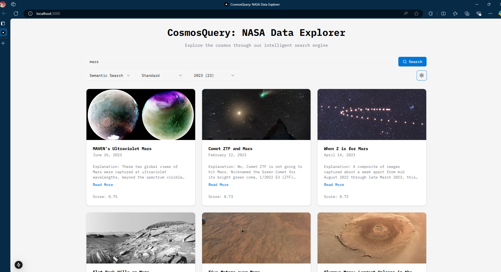
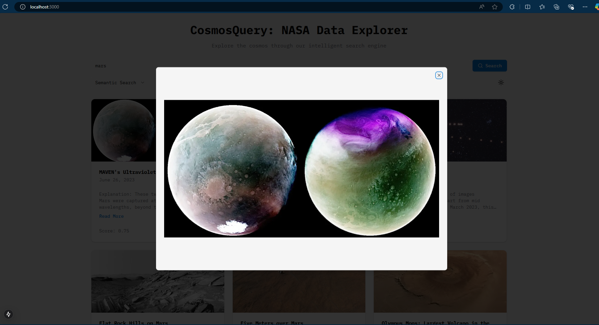

# CosmosQuery

## Overview
CosmosQuery is a modern web application that enables users to search and explore NASA-related data using an intelligent search engine powered by Elasticsearch. The application offers both regular and semantic search capabilities, allowing users to efficiently discover cosmic information through an intuitive interface.

## Demo




## Features
- **Dual Search Methods**: 
  - Regular Search with customizable tokenization
  - Semantic Search for context-aware results
- **Advanced Filtering**:
  - Year-based filtering
  - Customizable tokenizer options (Standard and N-gram)
- **Interactive Results Display**:
  - Card-based layout with images
  - Expandable content with "Read More" functionality
- **Real-time Statistics**:
  - Documents per year visualization
  - Search result analytics

## Tech Stack

### Frontend
- **Next.js 14**: React framework with app router
- **TypeScript**: For type-safe code
- **Shadcn**: UI component library
- **Tailwind CSS**: Utility-first styling
- **Lucide Icons**: Modern icon library

### Backend
- **FastAPI**: Modern Python web framework
- **Elasticsearch**: Search engine and database
- **Python 3.x**: Core programming language
- **Uvicorn**: ASGI server implementation
- **Pydantic**: Data validation

## Project Structure

```
cosmosquery/
├── frontend/
│   ├── app/
│   │   ├── layout.tsx
│   │   └── page.tsx
│   ├── components/
│   │   ├── ui/
│   │   └── shared/
│   ├── lib/
│   └── public/
└── backend/
```

## API Endpoints

### Search APIs

#### 1. Regular Search
```http
GET /api/v1/regular_search
```
**Parameters:**
- `search_query`: string
- `year`: number (optional)
- `tokenizer`: "standard" | "ngram"

#### 2. Semantic Search
```http
GET /api/v1/semantic_search
```
**Parameters:**
- `search_query`: string
- `year`: number (optional)

#### 3. Statistics
```http
GET /api/v1/get_docs_per_year_count
```
**Parameters:**
- `search_query`: string
- `tokenizer`: "standard" | "ngram"

## Installation

### Prerequisites
- Node.js 16+
- Python 3.8+
- Elasticsearch 7.x+

### Frontend Setup
```bash
# Navigate to frontend directory
cd frontend

# Install dependencies
npm install

# Create environment file
cp .env.example .env.local

# Start development server
npm run dev
```

### Backend Setup
```bash
# Navigate to backend directory
cd backend

# Create virtual environment
python -m venv venv
source venv/bin/activate  # On Windows: venv\Scripts\activate

# Install dependencies
pip install -r requirements.txt

# Create environment file
cp .env.example .env

# Start server
fastapi dev main.py
```

## Development Guidelines

### Frontend Development
- All components should be created in the `/components` directory
- Use server components for data fetching
- Implement proper error handling and loading states
- Follow TypeScript best practices
- Use Shadcn components with `npx shadcn@latest add [component]`

### Backend Development
- Implement comprehensive error handling
- Add logging for debugging
- Follow FastAPI best practices
- Write tests for API endpoints

## Environment Variables

### Backend (.env)
```
LOCALHOST=http://localhost:9200/
```

## Contributing
1. Fork the repository
2. Create your feature branch (`git checkout -b feature/AmazingFeature`)
3. Commit your changes (`git commit -m 'Add some AmazingFeature'`)
4. Push to the branch (`git push origin feature/AmazingFeature`)
5. Open a Pull Request

## License
This project is licensed under the MIT License - see the [LICENSE](LICENSE) file for details.

## Acknowledgments
- NASA for providing the data
- Elasticsearch for the search engine capabilities
- The open-source community for the amazing tools and libraries